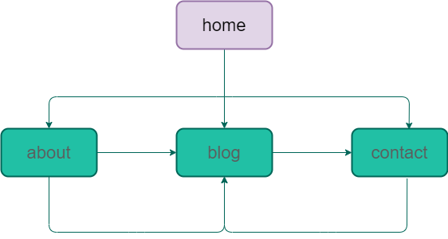

## Portfolio Site
Deployed [**repository**](https://cranky-babbage-d33d55.netlify.app/).

Github [**repository**](https://github.com/kinga977).

### Portfolio Website description
### Purpose
To demonstrate my skills as learning the coding system with vscode adn terminal, creating my first Portfolio

### functionality/Features

### HOME SECTION

   -nav bar to different pages

   -link to likedin and github profile

### ABOUT SECTION
   -information about me

   -my skill and experience

   -link to download my resume

### BLOG SECTION

   -blogs on 5 different posts

### CONTACT SECTION

   -link to my email-address

   -my phone number

   -links to my social media pages

### Sitemap

### Screenshots

### Tareget Audience
   -A portfolio describing my skiils and experience to the audience

   
### Tech stack
   -HTML 5 

   -CSS

   -Git/Github

